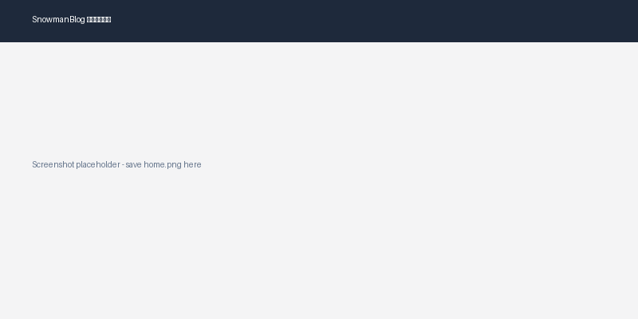

# SnowmanBlog (Python/Django)

<p align="center">
  
  
  
  
  
</p>

用 Python 复刻 [SnowmanNunu/SnowmanBlog](https://github.com/SnowmanNunu/SnowmanBlog)(Laravel 12 + Filament v3)的个人博客系统,技术栈为 **Django 5**。

## 📸 预览



> 截图待补充——请将首页截图保存为 `docs/screenshots/home.png`。

## ✨ 功能特性

| 模块 | 功能 |
|---|---|
| 📝 文章 | 列表分页、详情页(Markdown 渲染)、上一篇/下一篇、相关推荐、分类/标签/专栏体系、SEO Meta |
| 🔍 搜索 | 全站标题搜索(`/search/?q=`) |
| 💬 互动 | 留言板、嵌套评论(审核制)、文章点赞(防刷) |
| ⚙️ 后台 | Django Admin 全模型管理、回收站/软删除、定时发布(Celery Beat)、Cache 清理、数据备份导出 |
| 🌐 SEO | Sitemap(`/sitemap.xml`)、RSS(`/rss/`) |
| 🎨 前端 | 响应式布局 + 暗黑模式切换 |

## 🛠 技术栈

- **后端**: Django 5.x + Django Admin + `django-celery-beat`
- **数据库**: SQLite(开发)/ MySQL(生产,`DB_ENGINE=mysql` 切换, PyMySQL 驱动)
- **缓存/队列**: Redis(django-redis + Celery)
- **Markdown**: mistune
- **前台**: Django Template + 原生 CSS(主题变量)
- **储存**: django-storages(预留多端存储切换)

## 📁 项目结构

```
SnowmanBlog-Python/
├── config/            # 项目配置(settings/urls/wsgi/celery)
├── core/              # 首页、健康检查、软删除基类
├── blog/              # 文章/分类/标签/专栏 + Sitemap + RSS
├── interaction/       # 评论/留言/点赞
├── site_config/       # 站点设置/友链 + 缓存/备份 admin
├── templates/         # 共享 base 模板
├── deploy/            # Docker/Nginx 部署
└── seed_data.py       # 开发用示例数据脚本
```

## 🚀 本地运行

```bash
# 1. 创建虚拟环境并安装依赖(Python 3.12)
uv venv .venv --python 3.12
uv pip install -r requirements.txt

# 2. 启动 Redis(缓存 / Celery broker 需要)
redis-server --daemonize yes

# 3. 迁移并创建管理员
.venv/bin/python manage.py migrate
DJANGO_SUPERUSER_PASSWORD=你的密码 .venv/bin/python manage.py createsuperuser --noinput \
  --username admin --email admin@example.com

# 4.(可选)填充示例文章
.venv/bin/python seed_data.py

# 5. 启动
.venv/bin/python manage.py runserver
```

访问:
- 前台首页: http://127.0.0.1:8000/blog/
- 后台管理: http://127.0.0.1:8000/admin/
- 留言板: http://127.0.0.1:8000/guestbook/

> 定时发布 / 异步邮件需要同时运行 Celery worker 与 beat:
> ```bash
> .venv/bin/celery -A config worker -l info
> .venv/bin/celery -A config beat -l info
> ```

## 🐳 Docker Compose(六容器)

app / nginx / db(MySQL) / redis / celery-worker / celery-beat

```bash
cp .env.example .env   # 按需修改
docker compose up -d
```

## 🧪 测试

```bash
# 全量测试(40 项)
.venv/bin/python manage.py test blog interaction site_config core -v2
```

## 🔄 CI(GitHub Actions)

`.github/workflows/ci.yml` — push/PR 自动执行:**Ruff lint → Django system check → 全量测试**(Python 3.12)。
本地开发请安装 dev 工具:`uv pip install -r requirements-dev.txt`,提交前跑 `ruff check .`

## 🚀 生产部署(已上线示例)

本项目已部署到阿里云服务器,可通过 **http://pyblog.snowmannunu.top** 访问。

> 架构:**systemd 守护**(Gunicorn / Celery worker / Celery beat)+ **Nginx 反代**(宝塔托管域名)+ **Redis**,数据库用 **SQLite**。服务开机自启、崩溃自动重启。

### 一键部署(本机执行)

```bash
./scripts/deploy.sh   # 打包 → 上传 → migrate/collectstatic → 重启 systemd 服务 → 健康检查
```

### 部署要点
1. **服务器系统 Python 是 3.6** → 源码编译安装 Python 3.12 到 `/usr/local/python312`,再 `python3 -m venv .venv`。
2. **系统 SQLite 3.26 过旧**(Django 5 需 3.31+) → 安装 `pysqlite3-binary`,并放置**部署专用** `sitecustomize.py` 将标准库 `sqlite3` 替换为新版(仅服务器需要,不进 git)。运行/启动时必须 `export PYTHONPATH=/www/wwwroot/xxx`(使 sitecustomize 被加载)。
3. **MySQL 版本注意**:Django 5.x 要求 **MySQL 8.0+**,但本服务器是 MySQL 5.7,故生产用 SQLite。如需用 MySQL,请先升级到 8+ 再设 `DB_ENGINE=mysql`。
4. 环境变量:服务器上 `.env.deploy`(bash 风格,手动操作时 source)与 `.env.systemd`(KEY=value,供 systemd 使用),二者内容一致。

### systemd 服务管理(服务器)
```bash
systemctl status snowblog-gunicorn        # 应用(127.0.0.1:8000)
systemctl status snowblog-celery-worker   # 异步任务
systemctl status snowblog-celery-beat     # 定时调度(定时发布每分钟扫描)
journalctl -u snowblog-gunicorn -n 50     # 查看日志
```

## 📊 开发进度

截至阶段五已全部完成(阶段零 → 五 ✅),阶段六(部署 CI)待推进。详见 [`SnowmanBlog-Python开发计划.md`](SnowmanBlog-Python开发计划.md)。

## ⚠️ 说明

- 开发默认 **SQLite**;生产用 MySQL 需设置 `DB_ENGINE=mysql`(服务器 MySQL 5.7 需先升级到 8.0+ 并更新相关环境变量)。
- 存储设置页、搜索快捷键、异步邮件通知为待增强项。